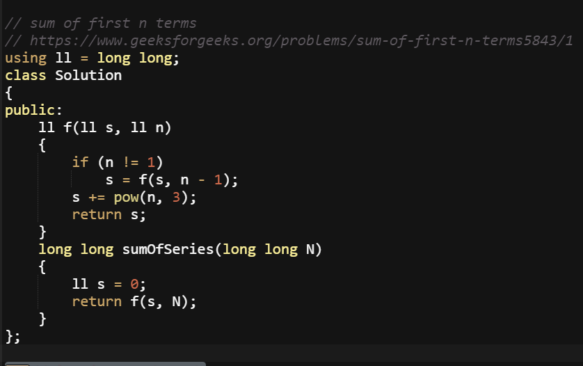
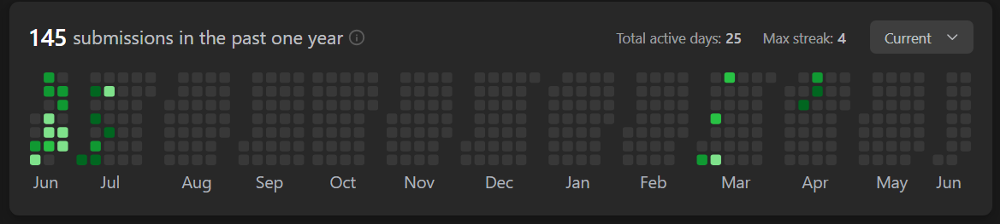
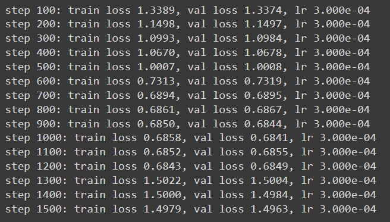
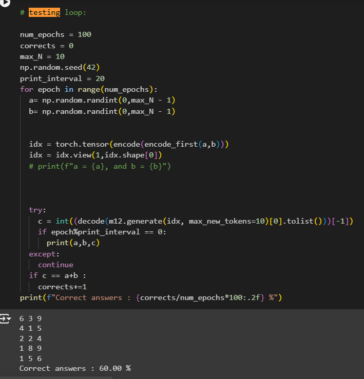

# 50-Days-of-Code

50 days of code, starting from 11th June , 2024 to 31st July, 2024

## Day 4 : June 14 , Friday

**Today's Progress**: Finished basics of cpp and reached recursion.

**Thoughts** Right now its kinda a struggle since its been a while since i coded in cpp, but its fun relearning all the old tricks :).
Will do ML tomorrow

**Link(s) to work**

1. 

## Day 3 : June 13 , Thursday

**Today's Progress**: Paused ML for a bit and started leetcode, made first submission. This is the picture of my old account (im starting a new one from scratch). I hope i can be consistent this time around!

**Thoughts** I thought ill do both ML and leetcode but procastinated a bit so couldnt get to ML! and once again woke up at 6 to code. I think ill do that on purpose now (instead of falling asleep early due to tiredness XD)

**Link(s) to work**

1. 

## Day 2: June 12, Wednesday

**Today's Progress**: Not much new code, just worked on hyperparameter tuning, and have an issue in the learning rate probably. (see how the loss shoots at step 1300? that's bad )
I will consult a friend and get back on it on Day 3.

**Thoughts** Today I had a tough day at work and slept early. Then woke up around 5 to get in my 2 hours of coding. This is not as easy as i thought lol.

**Link(s) to work**

1. 

## Day 1: June 11, Tuesday

**Today's Progress**: Wrote test loop for my GPT which adds two numbers. Right now performance is not good, just 60% accuraccy on adding single digit numbers.

**Thoughts** Today i managed to study ~10 hours and out of that put three towards coding. Though setting up the repo etc took way longer than i expected. Im excited to continue tomorrow as well, to fix this low score of my model.

**Link(s) to work**

1. 
